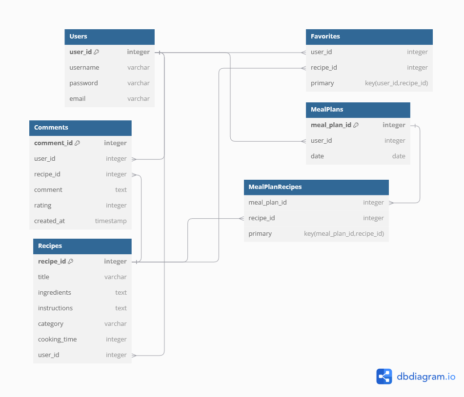

# Java Spring Project

## Functional Requirements

1. **User Registration and Login System**
   - Users must be able to create an account, log in, and manage their profile information.
   - Functionalities include: Sign up, log in, password reset, and profile update.

2. **Recipe Creation and Sharing**
   - Registered users must be able to create, edit, and delete their own recipes.
   - Each recipe includes a title, ingredients, instructions, cooking time, and an image.

3. **Recipe Browsing and Searching**
   - All users (including non-registered) should be able to browse, search, and filter recipes by categories (e.g., cuisine, dietary restrictions, preparation time).

4. **Meal Planner Feature**
   - Registered users must be able to create and manage weekly meal plans by selecting recipes from the available pool and adding them to their plan.

5. **Grocery List Generator**
   - Based on a user's selected meal plan, the system generates a grocery list that includes all the ingredients required for the selected meals.

6. **Recipe Rating and Commenting**
   - Registered users should be able to rate and comment on recipes they’ve tried. Each recipe must display average ratings and user feedback.

7. **Favorite Recipes**
   - Users must be able to mark recipes as favorites and access their saved recipes through their profile.

8. **Admin Panel for Managing Recipes**
   - Admin users should be able to manage and moderate user-generated content (e.g., delete inappropriate recipes or comments).

9. **REST API for Recipe Management**
   - The system must expose a REST API that allows external applications to interact with the recipe data (e.g., fetching, creating, and updating recipes).

10. **Scheduled Job for Meal Plan Reminders**
   - The system must send automatic weekly reminders to users with their meal plans and associated grocery lists via email.

## System Behaviors

1. **User Registration and Authentication**
   - Users can register for an account using an email and password.
   - Users can log in and log out.
   - System verifies credentials and generates a session or token for authentication.

2. **Recipe Creation and Management**
   - Registered users can create, edit, delete, and view recipes.
   - Recipes include a title, ingredients, instructions, and other details.
   - System stores recipes in the database and allows updates or deletions.

3. **Recipe Browsing and Searching**
   - All users (both registered and non-registered) can browse and search recipes.
   - System allows filtering based on criteria like cuisine, ingredients, or time to prepare.

4. **Meal Planning**
   - Registered users can create and manage meal plans by selecting recipes for specific days.
   - The system generates a grocery list based on the user's meal plan.

5. **Rating and Commenting**
   - Registered users can rate and leave comments on recipes they’ve tried.
   - The system stores and displays user ratings and comments.

6. **Favorite Recipes**
   - Registered users can mark recipes as favorites and view them in their profile.
   - The system stores user favorites and allows users to retrieve them.

7. **Admin Management**
   - Admin users can manage and moderate user-generated content (recipes, comments).
   - Admins can delete inappropriate recipes or comments.

8. **Scheduled Reminders for Meal Plans**
   - The system sends weekly reminders to users with their meal plans and grocery lists.
   - Scheduled jobs automate this process, sending emails to users.

## REST API Endpoints

1. **User Registration and Authentication**
   - **POST /api/auth/register**: Register a new user.
     - Request Body: `{ "name": "John", "email": "john@example.com", "password": "password123" }`
     - Response: `201 Created`
   
   - **POST /api/auth/login**: Log in an existing user.
     - Request Body: `{ "email": "john@example.com", "password": "password123" }`
     - Response: `200 OK` (JWT token or session ID)

2. **Recipe Management**
   - **GET /api/recipes**: Fetch a list of recipes.
     - Query Params: `?category=vegan&time=30` (optional filters)
     - Response: `200 OK`, List of recipes.

   - **POST /api/recipes**: Create a new recipe (only for authenticated users).
     - Request Body: `{ "title": "Pasta", "ingredients": "flour, water", "instructions": "Mix and cook" }`
     - Response: `201 Created`

   - **GET /api/recipes/{id}**: Fetch details of a specific recipe.
     - Response: `200 OK`, Recipe details.

   - **PUT /api/recipes/{id}**: Update an existing recipe (only for the owner of the recipe).
     - Request Body: `{ "title": "Updated Pasta", "ingredients": "flour, water, oil", "instructions": "Mix and cook" }`
     - Response: `200 OK`

   - **DELETE /api/recipes/{id}**: Delete a recipe (only for the owner or admin).
     - Response: `204 No Content`

3. **Meal Planner**
   - **POST /api/meal-plans**: Create a new meal plan for a user.
     - Request Body: `{ "user_id": 1, "recipes": [1, 2, 3], "week_of": "2024-10-07" }`
     - Response: `201 Created`

   - **GET /api/meal-plans/{userId}**: Get the meal plan for a specific user.
     - Response: `200 OK`, Meal plan details.

4. **Favorites**
   - **POST /api/favorites**: Mark a recipe as favorite for a user.
     - Request Body: `{ "user_id": 1, "recipe_id": 2 }`
     - Response: `201 Created`

   - **GET /api/favorites/{userId}**: Fetch all favorite recipes for a user.
     - Response: `200 OK`, List of favorite recipes.

5. **Rating and Commenting**
   - **POST /api/recipes/{id}/comments**: Add a comment and rating to a recipe.
     - Request Body: `{ "user_id": 1, "rating": 5, "comment": "Great recipe!" }`
     - Response: `201 Created`

   - **GET /api/recipes/{id}/comments**: Get all comments and ratings for a recipe.
     - Response: `200 OK`, List of comments and average rating.

6. **Admin Operations**
   - **DELETE /api/admin/recipes/{id}**: Admin can delete inappropriate recipes.
     - Response: `204 No Content`

7. **Scheduled Job**
   - **Job: Send Meal Plan Reminder**: A scheduled task that runs weekly to send an email reminder to users about their meal plans and grocery lists.
     - Description: A scheduled task that runs once a week to send an email reminder to users about their meal plans and grocery lists.

## ERD Diagram

